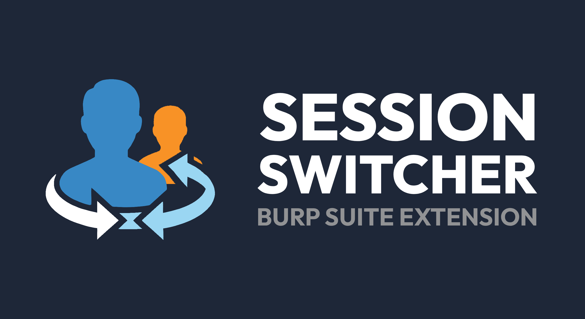
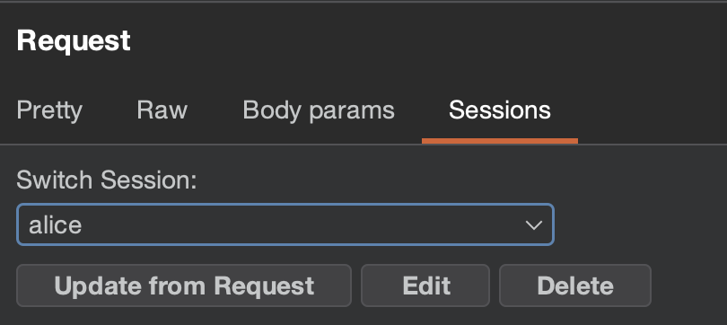
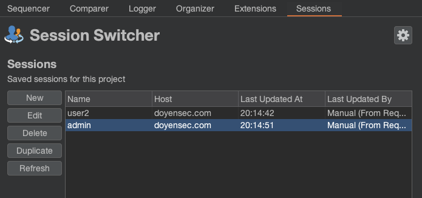
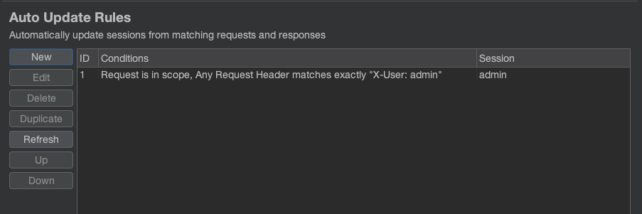
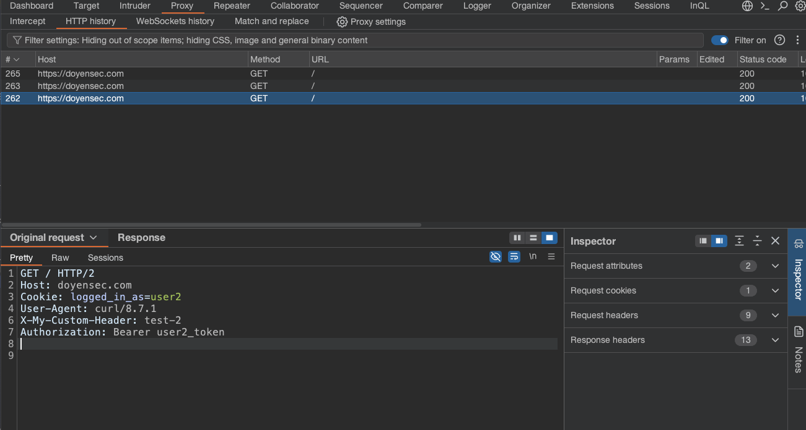

# Session Switcher - Burp Extension to Swap Sessions with One Click

[![Doyensec Research Island](https://img.shields.io/static/v1?logo=data:image/png;base64,iVBORw0KGgoAAAANSUhEUgAAACAAAAAgCAMAAABEpIrGAAAABGdBTUEAALGPC/xhBQAAACBjSFJNAAB6JgAAgIQAAPoAAACA6AAAdTAAAOpgAAA6mAAAF3CculE8AAACLlBMVEUsJx8sJx8sJx8tJx8xKiAvKR8rJx8uKB+CWCu7eDK5dzKxcjFTPSQqJh9nSCfskzn4mjv3mjr5mzurbzAwKSCiaS/3mTr0mDr1mTr1mDrqkjlrSicpJR9RPCTaijf2mTrjjjigaS+YZC6ZZS6ZZC6aZS7Vhja/ejM5LiErJh+JWyxxTignJB4oJR55UinxljrylzqCVyspJh9BMyLHfzTFfjQ+MSE4LiG5djLRhDVINyPvlTmKXCxOOiN2USl1UCh0TyhENSJkRyfpkjibZi40LCDXiDZOOiRgRCbljzf0lzn1mDmgaC4tKB+iai/hjTdcQiZdQybljzikay+dZi73mDnkjjdhRSZSPCTbijeyczEyKyDmkDjXhzX2mDn3mTm2dTGJXCztlDlzTylMOSM2LCCEWCr1lznvlDh3USk9MSF/Virwljl8VCrBezLJfzNCMyJwTiiLXSxQOyTijjivcTEoJR/0mDnwlTluTChDNCLWhza8eTMzKyCLXCzslDlENCLKgDTDfDM8MCF7VCrxlzoyKiCOXyzrkzlvTShHNiPPgzVbQiVUPiTeizeucDCTYS1qSidlRyelay/fjDdYQCWobTA2LSCVYi2qbjDcijc1LCBYPyVbQSVJNyM6LyG8eDJFNSJrSyiQYC3zlzrBezPLgTTShTW6dzKEWSt6UymWYy3AezORYC2XYy3aiTa4djJaQSViRiawcjH6nDv4mjqeZy6faC5LOSP////0Gs0gAAAAAnRSTlPw8aiV7g8AAAABYktHRLk6uBZgAAAAB3RJTUUH5wQDChERFF4OgAAAAhhJREFUOMuNk/dXE0EQx8lJNkgcwiLe7eLqAIq6ogYPBaWogFjAEAWxixqsxK5gLygigigasUWw99798wwE3puY98DPr/O5u5nvzSQkGCPiGKVuGP8jjEmMw8mo4Eoam/wP7nFABEjxpPJY0san0x6cE0zLskhdyIyJiggwaTKKzKzsKVGm5kxDPn2GJlPATCk9ubNgiNlzvDJvrk0EnT8P+fyCyDNaKaVZ4QITFxYByUHlFkurBAxdumjxkjKtyisELqVBsUo3x2XLAVasrKpe5WPOGi78q4EkqdbUCl7nYq619dXr1gNs2Ih802ZGovbloNhSbkPp1oZt2ysZ7JAy0KiIADsjsyXvYrC7as/efSradpMmPwuCeXL/AdAFBxvqDx3W6khAWkcZFY4dF6nNLqOlBE+cPKXg9BnkZ88RQZ+35IVGgIutyC9d1qrNK68kkU8M9u1uZ/qqkB3XFHR2ReIuJIKzxhT+6wDdNwS/mciMHpQVt2ySw+0MgdkGSw+Z4k4v2L1+we86SZL3mgOe1k5QKR0S7zPW/sDEh90kSRZ+1NfXz/TjJyZ2PQX1LCDlcx2ztLZSYKjgC+kN2rrpJeKr/FhhcJL+14hvwqrlrSWL39F9GOY9WvLDx55PnwX/EmZxgvqaKSxLDOykqP1mxx0OC3//8XOItCxf/GVB0a9QXZTQ7z8QLwy8ZBgdc1mj3KZj5LrjL1F7eEeDTryKAAAAJXRFWHRkYXRlOmNyZWF0ZQAyMDIzLTA0LTAzVDEwOjE3OjEyKzAwOjAwECxG2gAAACV0RVh0ZGF0ZTptb2RpZnkAMjAyMy0wNC0wM1QxMDoxNzoxMiswMDowMGFx/mYAAAAgdEVYdHNvZnR3YXJlAGh0dHBzOi8vaW1hZ2VtYWdpY2sub3JnvM8dnQAAABh0RVh0VGh1bWI6OkRvY3VtZW50OjpQYWdlcwAxp/+7LwAAABh0RVh0VGh1bWI6OkltYWdlOjpIZWlnaHQAMTkyQF1xVQAAABd0RVh0VGh1bWI6OkltYWdlOjpXaWR0aAAxOTLTrCEIAAAAGXRFWHRUaHVtYjo6TWltZXR5cGUAaW1hZ2UvcG5nP7JWTgAAABd0RVh0VGh1bWI6Ok1UaW1lADE2ODA1MTcwMzLks9aDAAAAD3RFWHRUaHVtYjo6U2l6ZQAwQkKUoj7sAAAAVnRFWHRUaHVtYjo6VVJJAGZpbGU6Ly8vbW50bG9nL2Zhdmljb25zLzIwMjMtMDQtMDMvMWVjNTYyMTlhZWY0YzQ4MDI1N2Y2YWFjYzUxM2M0Y2MuaWNvLnBuZ98kODgAAAAASUVORK5CYII=&link=https://doyensec.com/research.html&message=Research%20Island&&label=Doyensec&color=purple)](https://doyensec.com/research.html)





## :rocket: Introduction

Session Switcher is a Burp Suite extensions that allows to easily switch the "session" (cookies and headers) of an HTTP request to a different one on the fly, tailored for manual authorization testing.

## :star2: Features

The typical use case for Session Switcher is to replace cookies and headers in a request, in the Repeater or in the Proxy, with only a couple clicks; the goal is to quickly check for vulnerabilities such as horizontal and vertical authorization issues or IDORs.

### Request Editor



This is the main tool of the extension, and it has everything you need for manual testing.

Here you have the main session selector that swaps the request's session with the one you choose. The buttons just under it will allow you to quickly create, delete, modify, and update sessions.

### Sessions Tab



The Sessions tab lists all the sessions stored in the project file and allows you to manage them.

### Auto Update Rules



The Auto Update rules will allow you to set some rules to make sure the sessions stay up to date automatically!

For example, if you use [PwnFox](https://addons.mozilla.org/it/firefox/addon/pwnfox/), you could create rules that watch for requests with the specified `X-PwnFox-Color` header and automatically update the corresponding session. This way, you will never have to worry about manually updating the session when the cookies or authentication tokens expire.

### Customizable Behavior

From the extension settings, you can control how it behaves in some situations, such as when updating or swapping sessions.

## :mag_right: How to use it

Some terminology first:
- **UPDATING** a session means copying cookies and headers **FROM an HTTP request** to the stored session.
- **INJECTING/swapping/switching/applying** a session means copying the cookies and headers stored in the session **TO an HTTP request**.

### Basic Usage

First of all, you need some Sessions.

1. Start by selecting a request and clicking the "New" button to create a new Session; the extension will automatically copy all cookies and (uncommon) headers from the request.
2. Once you have at least one session, you can use the selector to swap the session of any editable request, for example in the Repeater or while intercepting a request in the Proxy

By default, the switcher only lists the sessions for the request's domain. You can change this behavior in the settings.



The buttons in the request editor do the following:
- **New**: (when no session is selected) creates a new session, copying cookies and headers of the current request
- **Update**: (when a session is selected) copies cookies and headers of the current request **TO** the selected session
- **Edit**: opens the session edit window
- **Delete**: deletes the selected session

Note that the buttons only affect the **session** and do not change anything in the request.

### Managing Sessions

You can also create sessions manually from the Session tab. From there, you can manage and check the contents of all the stored sessions; you can also manually edit them if needed.

### Auto Update Rules

You can use these rules to automatically update a session from a matching request received by the proxy. Read more on how to use them in [docs/auto_update_rules.md](docs/auto_update_rules.md).

# :arrow_down: Installation
This extension needs at least Burp v2025.5. It will not work on older versions.

# :computer: Building the Session Switcher extension from git

1. Install Java 21+. For example, in Debian-based distros:

```bash
$ sudo apt install -y openjdk-21-jdk
$ java --version
openjdk 21.0.9 2025-10-21
```

2. Clone the repo

```bash
$ git clone https://github.com/doyensec/burp-session-switcher
$ cd burp-session-switcher
```

3. Build Session Switcher using Gradle

```bash
$ ./gradlew build
```

Load the file `SessionSwitcher.jar` into Burp as a Java extension.


# :handshake: Contributing

The Session Switcher Burp Extension thrives on community contributions. Whether you're a developer, researcher, designer, or bug hunter, your expertise is invaluable to us. We welcome bug reports, feedback, and pull requests. Your participation helps us continue to improve the extension, making it a stronger tool for the community.

Interactions are best carried out through the GitHub issue tracker, but you can also reach us on social media ([@Doyensec](https://twitter.com/Doyensec)). We look forward to hearing from you!

# :busts_in_silhouette: Contributors

A special thanks to our contributors. Your dedication and commitment have been instrumental in making this extension what it is today.

Current:
- **Author:** Savio Sisco [@lokiuox (Github)](https://github.com/lokiuox)

This project was made with the support of [Doyensec](https://doyensec.com/research.html).

   

